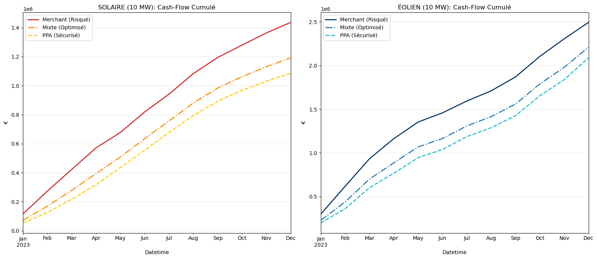

# Renewable Asset Valuation & Hedging Strategy (France 2023)

## Context & Objective
I built this project to simulate the financial reality of renewable energy producers in France.
Using 2023 real-world data, my goal was to answer a critical question: **How to balance profitability and risk when managing a portfolio of Wind and Solar assets?**

This repository contains the full workflow: from raw data extraction (ETL) to the backtesting of hedging strategies (Merchant vs. PPA).

## Methodology

I structured the analysis following a logical quantitative workflow:

**1. Data Engineering & Preparation**
* Loading and cleaning raw data from RTE (handling missing values and zero-production artifacts).
* Merging Grid data with EPEX SPOT market prices to create a unified financial dataset.

**2. Grid & Mix Analysis**
* **Thermosensitivity:** Visualizing the impact of seasonality and temperature on French consumption.
* **Generation Mix:** Analyzing the daily contribution of Nuclear, Hydro, and Renewables.

**3. Stress Testing (Peak Load)**
* Deep dive into the **Annual Peak Load** event (~80GW).
* Analysis of the **Residual Load** to understand why prices react (or don't) during high demand.

**4. Market Fundamentals**
* **Correlation Analysis:** Studying the relationship between Demand and Spot Prices (Merit Order Effect).

**5. Financial Valuation**
* **Capture Prices:** Calculating the real market value of Solar and Wind MWh vs Baseload.
* **Cannibalization:** Quantifying the discount suffered by Solar assets during midday peaks.

**6. Portfolio Strategy & Risk Management**
* Comparison of **Solar vs Wind** performance.
* Simulation of 3 hedging strategies for a 10 MW asset:
    * *Merchant (100% Spot)*
    * *PPA (100% Fixed)*
    * *Optimized Mix (70% PPA / 30% Spot)*

## Key Findings (2023 Backtest)

### 1. Wind vs. Solar Performance
Wind assets significantly outperformed Solar in 2023.
* **Reason:** Wind generation is positively correlated with high winter prices (demand peaks), whereas Solar produces during lower-priced hours.

### 2. The Cost of Risk (Volatility)
I measured the monthly revenue standard deviation to quantify risk.
* **Merchant Strategy:** Extremely volatile (Standard Deviation > €74k/month for Wind).
* **PPA Strategy:** Switching to a PPA reduced financial volatility by **32%**.

### 3. Final Recommendation
Based on the Sharpe Ratio logic (Risk/Reward), the **Mixed Strategy (70% PPA / 30% Spot)** is optimal.
* It secures debt coverage via the PPA.
* It captures market tension upside (scarcity pricing) during cold snaps via the 30% spot exposure.

## Tech Stack
* **Language:** Python
* **Libraries:** Pandas (Time-series manipulation), Matplotlib (Visualization), NumPy (Vectorized calc).
* **Data Sources:** RTE (Open Data) & EPEX SPOT.

---
**Author:** Yanis ALLAS  
Connect with me on LinkedIn: [linkedin.com/in/yanis-allas-5600b4294](https://www.linkedin.com/in/yanis-allas-5600b4294/)
